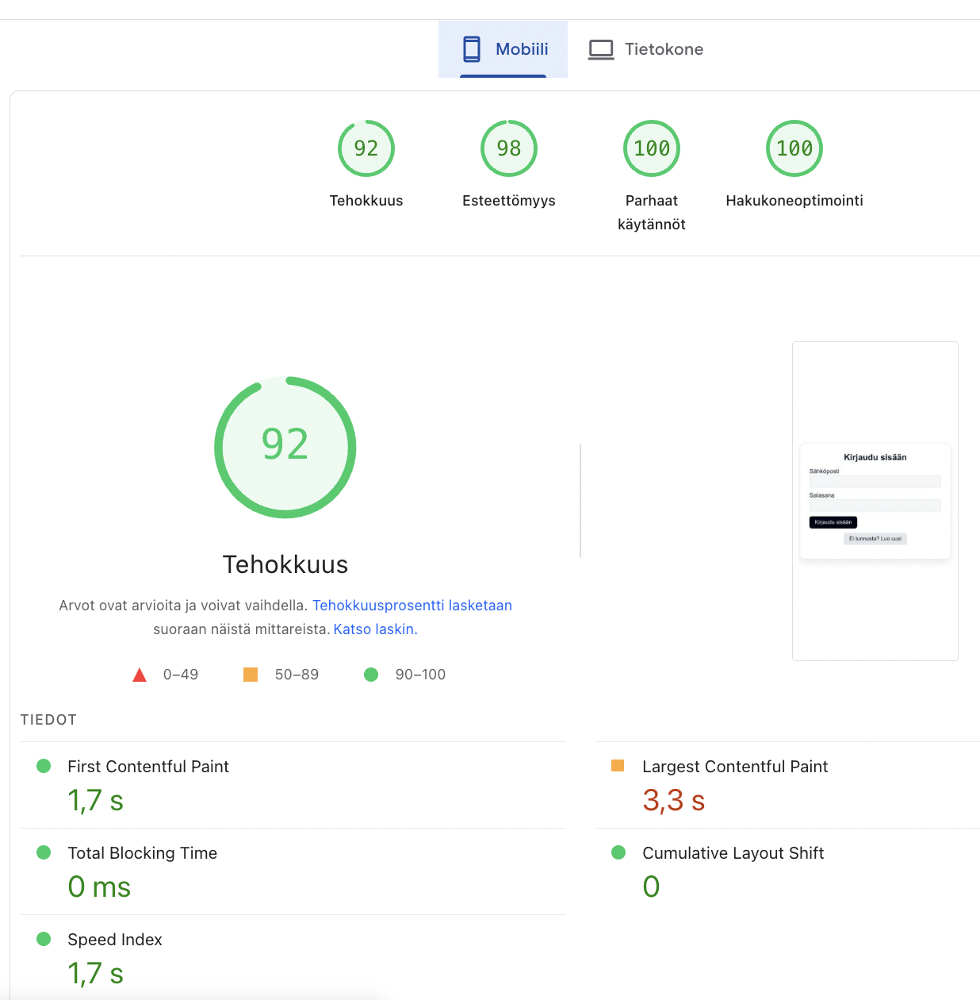

# Harjoitustyö: Käyttäjäkohtainen sääsovellus

## Idea

Sovellus on käyttäjäkohtainen **sääpalvelu**, jossa käyttäjä voi kirjautua sisään ja tallentaa omia **suosikkikaupunkejaan**.  
Sovellus hakee ajantasaiset säätiedot OpenWeatherMapin rajapinnan (REST API) kautta ja näyttää lämpötilan, sääkuvauksen sekä kuvakkeen.  

Tavoitteena oli tehdä käytännöllinen ja helppokäyttöinen sivusto, joka tarjoaa käyttäjälle hyödyllistä tietoa arjessa.

---
### Toimivuus eri päätelaitteilla

**Desktop**  
Sovellus toimii moitteettomasti. Kaikki elementit latautuvat ja asettuvat oikein.  
Käyttäjäkokemus on sujuva ja selkeä. Kortit asettuvat kolmen sarakkeeseen ja sisältö pysyy keskitettynä.

**Tablet**  
Layout mukautuu hyvin vaakasuunnassa. Pystysuunnassa elementit asettuvat siististi allekkain.  
Käytettävyys säilyy hyvänä molemmissa suunnissa.

**Mobiili**  
Sivusto on täysin responsiivinen ja käytettävä. Elementit mukautuvat näytön kokoon. Navigointi ja lomakkeet toimivat hyvin myös pienillä näytöillä.

---

## Toimivuus uusimmilla selaimilla

Sivusto on testattu uusimmilla selaimilla, ja se toimii kaikissa moitteettomasti:

- **Google Chrome (v120)** – ei havaittuja ongelmia  
- **Mozilla Firefox (v122)** – kaikki toiminnot toimivat oikein  
- **Microsoft Edge (v120)** – sivu latautuu nopeasti ja toimii virheettä
- **Safari (v17)** – Ei havaittu ongelmia
  

Kaikilla selaimilla kirjautuminen, kaupungin lisäys/poisto ja säätietojen haku toimivat oikein.

---

## Testaus

## Yhteenveto

Sovellus on teknisesti toimiva ja responsiivinen kaikilla päätelaitteilla.  
Latausajat ovat erittäin hyvät sekä mobiilissa että desktopissa, mikä tekee käyttökokemuksesta sujuvan.  
Sivusto noudattaa saavutettavuus- ja käytettävyysperiaatteita, toimii uusimmilla selaimilla ja käyttää moderneja web-teknologioita (React, Firebase, OpenWeatherMap API).

Sovellus täyttää harjoitustyön arviointikriteerit:
- Käyttäjäkohtainen idea ja hyödyllinen sisältö  
- Tiedon tutkiminen (sääkortit ja virheilmoitukset)  
- Käytettävyys ja WCAG-yhteensopivuus  
- Responsiivisuus eri laitteilla  
- Firebase-autentikointi ja tietokanta  
- Kolmannen osapuolen REST-rajapinta  
- Nopea latausaika ja hyvä tekninen toimivuus

**Linkki sivulle:**  
👉🏼 *[Sääsovellus](https://tonysiren.github.io/pilvipalvelut-web-kehityksessa-tehtavat/saasovellus/)*

**Kirjaudu sisään tunnuksilla:** 

**Sähköposti:**  saasovellus@pilvi.fi
**Salasana:**  100aaa

